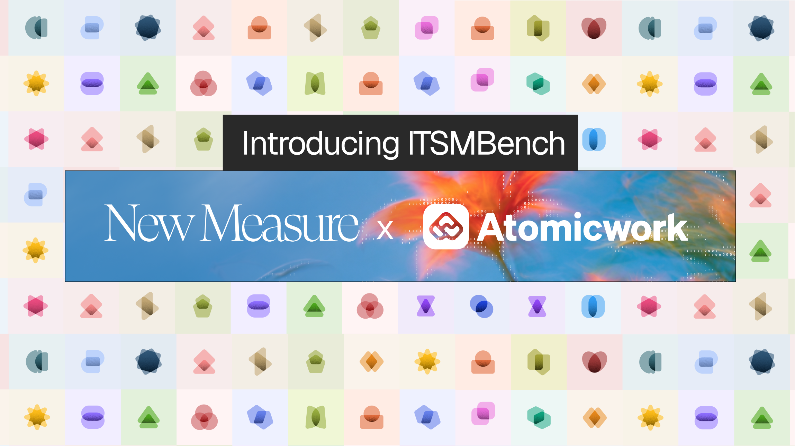

# ITSMBench

<!-- Hero image placeholder — replace when ready:
<p align="center">
  
</p>
-->

<p align="center">
  <a href="#"></a>
  <a href="#"></a>
  <a href="#"></a>
</p>

ITSMBench measures how well coding agents handle real IT service-management
work. Each task
drops an agent into a containerized enterprise environment with a ticket-style
instruction and a hidden verifier; the agent investigates systems, takes the
right actions, and is scored on whether the environment matches the expected
outcome. 


- Dataset: _Harbor Hub URL TBD_
- Leaderboard: _public leaderboard URL TBD_


## Getting started


### Prerequisites

- Install [Harbor](https://github.com/laude-institute/harbor).
- Add the required provider key to `.env` (see `.env.example`).
- For Daytona runs, also add `DAYTONA_API_KEY` and ensure the configured snapshot exists.
- For local runs, start Docker.

### Setup

The same tasks run in either environment, selected at run time:

| Variant | Environment | What it isolates |
|---|---|---|
| Daytona (default in configs) | Remote Docker-in-Docker via Daytona | Scale-out runs with a shared snapshot |
| Local Docker | Local Docker engine | Fully local debugging without Daytona |

Running both is useful when you want remote throughput for full sweeps and a
hermetic local path for developing or debugging a single task. Full-suite
configs live under `configs/`; each schedules all 89 tasks across its
configured agents, models, reasoning levels, and attempts.

## Run one task

### Daytona

This runs one `task-a-1` trial with Pi and GPT-5.6 Sol:

```bash
set -a && source .env && set +a

JOB="gpt-task-a-1-$(date +%Y%m%d-%H%M%S)"

harbor run \
  --job-name "$JOB" \
  -p tasks/task-a-1 \
  -a pi \
  -m openai/gpt-5.6-sol \
  --agent-kwarg thinking=high \
  -e daytona \
  --environment-import-path environments.reliable_daytona:ReliableDaytonaEnvironment \
  --environment-kwarg dind_snapshot=harbor-dind-emulator-1c2g5d-v4 \
  --env-file .env \
  -n 1 \
  -y
```

Change `tasks/task-a-1`, the agent, model, or thinking level as needed.

### Local Docker

Prepare the task workspace and pinned emulator, then run the same trial locally:

```bash
set -a && source .env && set +a

TASK=task-a-1
MAIN_IMAGE=$(awk -F '"' '/^docker_image = / {print $2}' "tasks/$TASK/task.toml")
EMULATOR_SOURCE='public.ecr.aws/f8p0s4x7/taskgen-emulator@sha256:a3dc8a1f0c354e973937d95550bb1e67a0e4cfd810bdddc34191317d60a8b5ab'
EMULATOR_TARGET='harbor.local/taskgen-emulator:a3dc8a1f0c35'
JOB="gpt-${TASK}-local-$(date +%Y%m%d-%H%M%S)"

docker pull "$EMULATOR_SOURCE"
docker tag "$EMULATOR_SOURCE" "$EMULATOR_TARGET"
docker build -t "$MAIN_IMAGE" "tasks/$TASK/environment"

harbor run \
  --job-name "$JOB" \
  -p "tasks/$TASK" \
  -a pi \
  -m openai/gpt-5.6-sol \
  --agent-kwarg thinking=high \
  -e docker \
  --no-delete \
  --env-file .env \
  -n 1 \
  -y
```

`--no-delete` preserves the local images for later runs.

## Run all tasks

Each file under `configs/` is a complete model run across all tasks. For example, to run the GPT configuration:

```bash
set -a && source .env && set +a

JOB="gpt-full-$(date +%Y%m%d-%H%M%S)"

harbor run \
  -c configs/gpt.yaml \
  --job-name "$JOB" \
  --env-file .env \
  -y 2>&1 | tee "runs-${JOB}.log"
```

Replace `configs/gpt.yaml` with another file under `configs/` to run a different model configuration. `configs/gpt.yaml` currently schedules all 89 tasks across its configured agents, models, reasoning levels, and attempts.

### Daytona snapshot

The configs use the shared Daytona snapshot `harbor-dind-emulator-1c2g5d-v4`. You do not need to rebuild it for every run.

Check it before running:

```bash
~/.local/share/uv/tools/harbor/bin/python \
  scripts/build_dind_snapshot.py status
```

Build it only if it is missing, or if task Dockerfiles or pinned images changed:

```bash
~/.local/share/uv/tools/harbor/bin/python \
  scripts/build_dind_snapshot.py build
```
